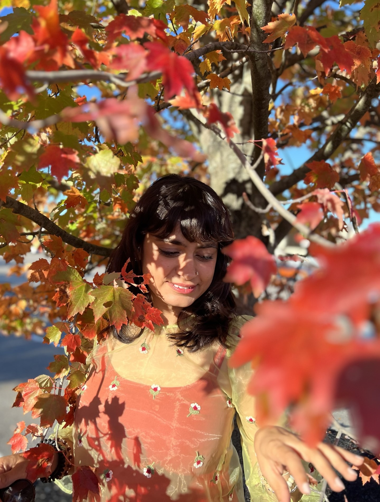

# Parvaaz Godara...
...is a professional architect but photography and
painting help her appreciate creative flow in everyday life.

#### Photography
Driven by a deep appreciation for the aesthetic elements of architecture Parvaaz infuses artistry into every frame. From the play of light and shadow to the harmony of lines and shapes, each photograph is a testament to the photographer's commitment to elevating the ordinary into the extraordinary.

#### Painting
For acrylic painting, the process is as integral as the product for Parvaaz as she immerses herself in a fluid dialogue with the canvas, allowing spontaneity and intuition to guide her hand.

#### Architecture
Parvaaz is an experienced Architectural Designer with a demonstrated history of working in the construction industry. She is skilled in AutoCAD, SketchUp, REVIT, Adobe Creative Suite, Adobe Indesign CC, and Adobe Illustrator. She received a Master of Architecture (M.Arch.) from Boston Architectural College.

- Architectural Designer with 5+ years of experience leading residential and civic projects from concept through
construction.
- Proficient in Revit, AutoCAD, and 3D visualization tools.
- Adept at coordinating with multidisciplinary teams, presenting to clients, and producing high-quality architectural drawings and renderings.
- Passionate about thoughtful design, community engagement, and artistic exploration.
